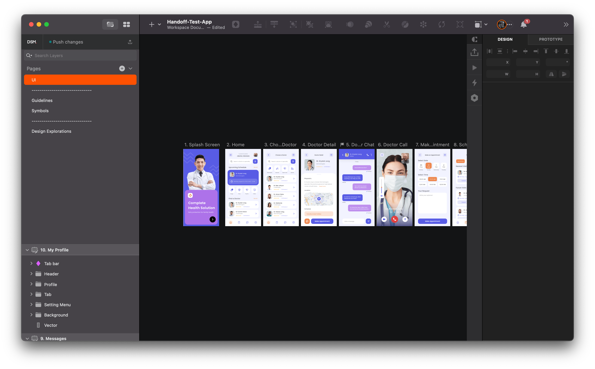
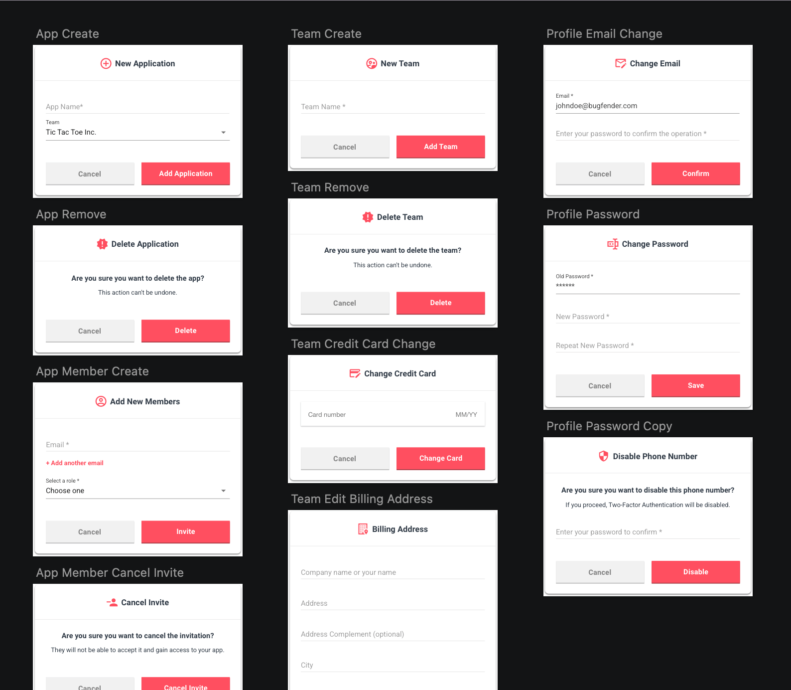
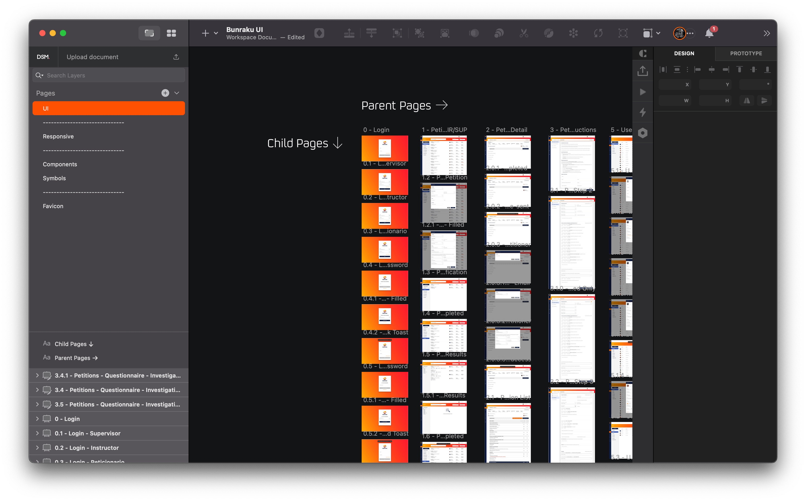
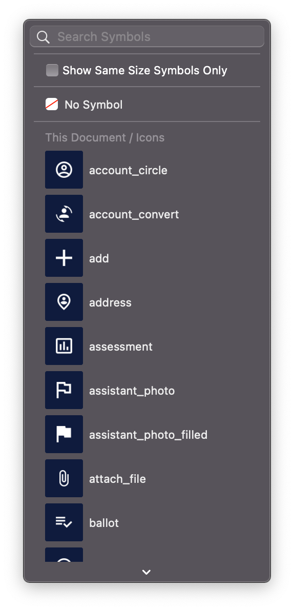
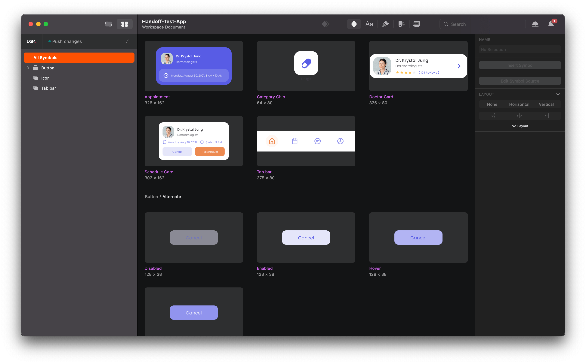
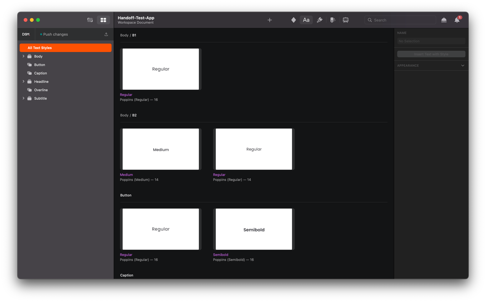
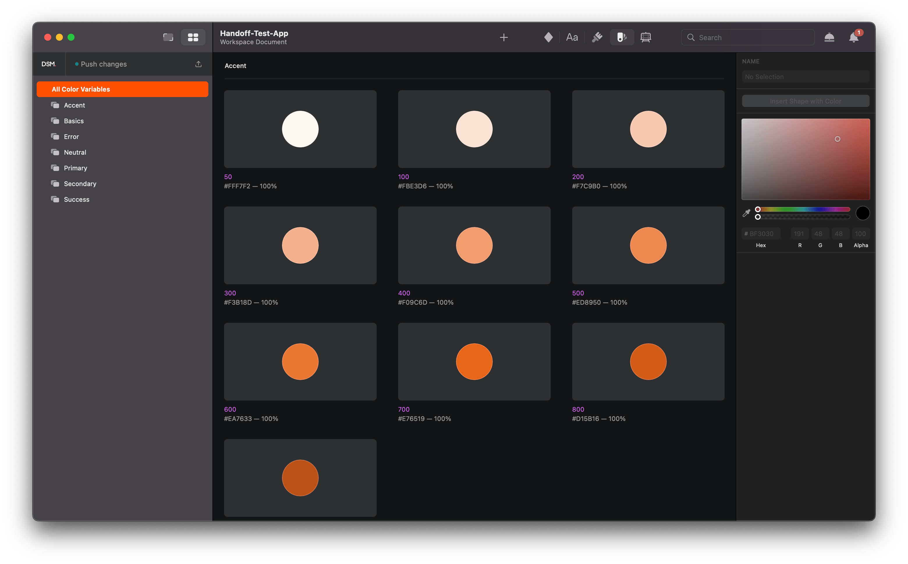

import Tabs from '@theme/Tabs';
import TabItem from '@theme/TabItem';

<Tabs defaultValue="file-organization" values={[
    { label: 'File Organization', value: 'file-organization', },
    { label: 'Artboards', value: 'artboards', },
    { label: 'Icons', value: 'icons', },
    { label: 'Symbols', value: 'symbols', },
    { label: 'Text Styles', value: 'text-styles', },
    { label: 'Color Styles', value: 'color-styles', },
]}>


<TabItem value="file-organization">

## File organization

**Pages**



* The first page of a document should always be the latest up-to-date UI, and include the whole design for the entire platform.
* Use separators to differentiate between page types. Do not place any designs inside a "separator" page. They must always be blank.
* Separators are made from 30 dashes: `------------------------------`

```
XXX UI
------------------
Components
Symbols
------------------
Design Explorations
Extra Pages
```

:::caution Exceptions
In extremely large projects with a huge amount of screens, we can use pages to split the design in different areas (i.e. Onboarding, Dashboard, Profile, Settings, etc.) and use one page for each flow.
:::

**Components**



* Components are items that appears inside a page but aren't a view themselves. Including modals, alerts, tooltips, sheets, sidebars among others.
* Follow the same structure as artboards (parent/child).
* Name components with the actions they do.
* Do not add numerical references to components.

```
Modal - Renew Password
Modal - Update Preferences
Modal - Update Profile
 Modal - Update Profile - Validation
Tooltip - Email
Tooltip - Graph Detailed Info
```
</TabItem>

<TabItem value="artboards">

## Artboards



```
[#] - [Parent] - [Child] - [Child of Child]
```

**Number**
* 0, 1, 2, 3, 4, 5, 6, 7, 8...

:::info Rules
* Do not add zeros in front of any number (i.e.: 01 (wrong) vs 1 (right)).
* Use spaces between elements.
* Parent views are placed left-to-right.
* Child views are placed top-to-bottom (in-line with their parent views).
* Use capitalization for titles.
:::

**Parent**
* Defines the parent view
  * `1 - Dashboard`

**Child & Child of Child**
* Variations of a parent or child view
  * `1.1 - Dashboard - Empty`
  * `1.1.1 - Dashboard - Empty - Validation Error`

</TabItem>

<TabItem value="icons">

## Icons



```
[Icon] / [Name]
```
:::info Rules
* Exportable icons should include the prefix "ic_".
* All icons should be a symbol under the same category `icons/icon_name`
* The base size of the icons should be 1:1 ratio.
* All icons must have a color style applied to it.
:::

**Name**
* Use the standard name for the icon, usually found in the icon set.
  * `ic_scrible`
  * `ic_trash.circle`

</TabItem>

<TabItem value="symbols">

## Symbols



```
[Component] / [Variation] / [Variation]
[x] / [Variation] / [Variation]
```

:::info Rules
* Atoms used in the design should be placed under "x" category in the root "folder" of symbols.
:::

**Symbol**
* Defines the main symbol name.
  * `Route Card`
  * `Bike Info`
  * `Icons`

**Variation/s**
* Variations of the same main component.
  * `Route Card / Completed`
  * `Route Card / Draft`

**X**
* Atoms.
  * `X / Road Type / Straight`
  * `X / Road Type / Curved`

</TabItem>

<TabItem value="text-styles">

## Text Styles



```
[Category] / [Name] / [Weight]
```

**Categories**
* Headings
* Body
* Button
* Caption
* Overline

**Names**
* H1, H2, H3, H4, H5, H6
* B1, B2
* Button
* CP
* OV

**Weights**
* Bold
* Semibold
* Regular
* Light

</TabItem>

<TabItem value="color-styles">

## Color Styles/Variables



```
[Name] / [Shade]
```

**Name**
* Primary
* Secondary
* Third
* Accent
* Neutral
* Basics
* Error
* Warning
* Success

**Shades**
* 900, 800, 700, 600, 500, 400, 300, 200, 100, 50

</TabItem>

</Tabs>
