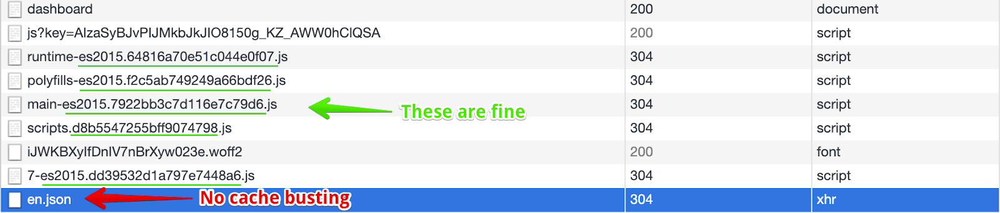

## Add cache busting to `ngx-translate` i18n files

**The problem**: translation files cache is not refreshed after deploy.



**Solution**:

1. Install `ngx-build-plus`, this allows to add custom Webpack partial configs.
2. Update `angular.json` to use `ngx-build-plus` as builder. Replace all instances of `@angular-devkit/build-angular:browser` with `ngx-build-plus:browser`.
3. Create [`webpack.partial.js`](https://gist.github.com/doup/30b9435f8128b338695fafe885ddf764#file-webpack-partial-js).
4. Update `package.json` to [use the new Webpack partial](https://gist.github.com/doup/30b9435f8128b338695fafe885ddf764#file-package-json-md)
5. Update `ngx-translate` `TranslateHttpLoader` config to [use the i18n hash](https://gist.github.com/doup/30b9435f8128b338695fafe885ddf764#file-app-module-ts-md).

## Build with zero downtime on Angular

The recommended way to have zero downtime it's using dockerized builds with a docker registry service.
In case that this isn't possible in your project, here you have a quick fix.

Create this folders on `/dist`:

1. `/dist/previousbuild`
1. `/dist/nginx` (the new production path)

`package.json` add on `scripts` section:

```json
...
"prebuild": "rm -rf dist/previousbuild",
"build": "ng build --prod --source-map --optimization=true --buildOptimizer=true --progress=true",
"postbuild": "mv dist/nginx dist/previousbuild && mv dist/tempbuild dist/nginx",
...
```

`angular.json` add on `projects -> *projectname* -> architect -> build -> options`:

```json
...
"outputPath": "dist/tempbuild",
...
```

And the result:

1. on build starts, the folder `previousbuild` will be erased
1. the new build will be created on `tempbuild`
1. when the new build is done, the previous production build will move to `previousbuild` and the new one will be on
 `nginx` folder
1. in case that you need to recover the previous version, you only need rename the two folders
