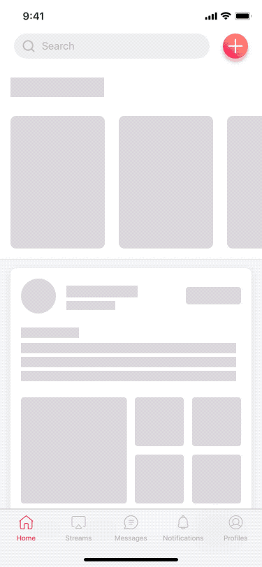
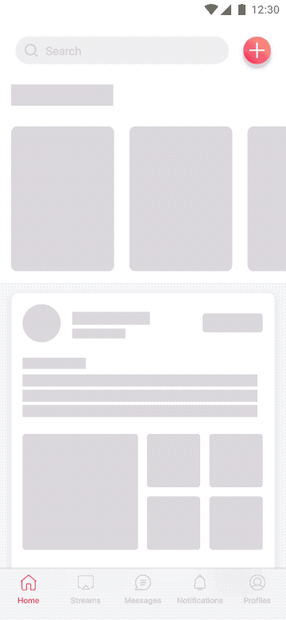
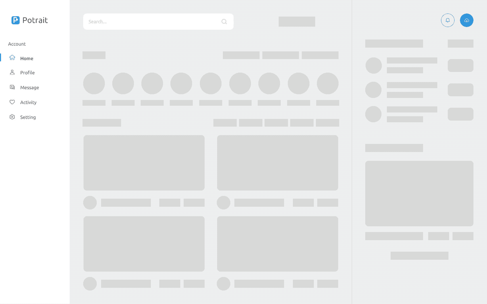

## Use Case
When navigating to a new screen where content needs to be loaded without blocking the UI.

## Contents
* Placeholders

## Best Practices
* When loading, placeholders of the size of the expected content are shown to users.
* To indicate it's loading and not broken, placeholders should have some kind of animation (blink, fade...).
* Elements must not be clickable until content is fully loaded.

## Best used for
* Transitioning to a new view and loading new content.

## Alternative
* If looking for an easier, faster alternative, check the [Basic Content Loading](../basic-content-loading) component.

## Screenshots/Demo
### iOS

### Android

### Web

