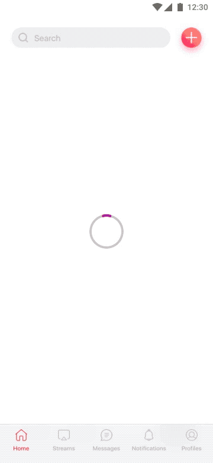
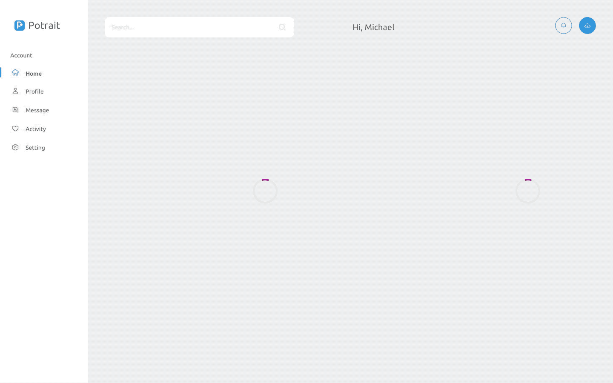

## Use Case
When navigating to a new screen where content needs to be loaded without blocking the UI.

## Contents
* Loading Spinner

## Best Practices
* If there are different areas to loading at different times, we can display a spinner per area (see web .gif example where the main content and the sidebar loads independently).
* Do not use more than 2 spinners at the same time in the screen. If needed, it's better to display only one and show the contents when everything has finished loading.

## Best used for
* Transitioning to a new view and loading new content.

## Alternative
* A better alternative for content loading can be found in the [Advanced Content Loading](../advanced-content-loading) component, although requires more time to implement.

## Screenshots/Demo
### iOS

### Android

### Web

