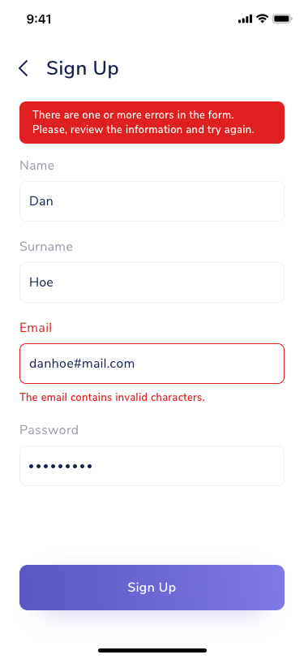
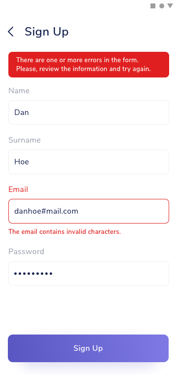

## Use Case
When there's one or more errors in a submited form and we want to give user's context. Also useful to display errors in the submission process.

## Contents
* Banner
* Text (error)

## Best Practices
* Place the banner on top of the formulary.
* Can be used together with [Input Specific Errors](formulary-input-error).

## Best used for
* Giving context on formulary errors.
* Displaying submission process errors.

## Screenshots/Demo
### iOS

### Android

### Web

