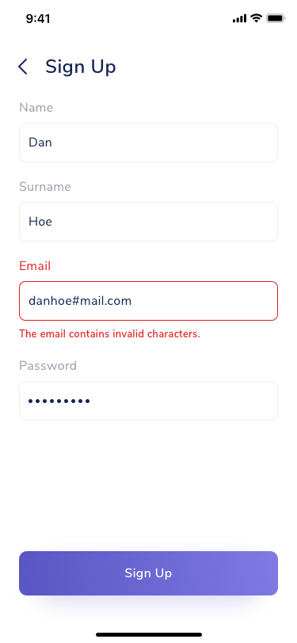
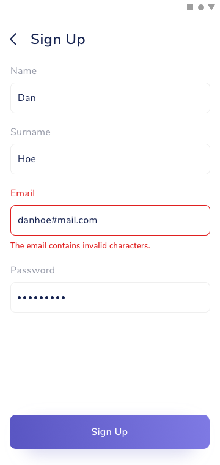

## Use Case
We detect a validation error in one input field.

## Contents
* Input text
	* Placeholder
	* Contents
	* Error information (below the input)

## Best Practices
* Write the error information below the affected input
* Highlight the input field  and placeholder in red
* Whenever possible, scroll automatically where the first error is.

## Best used for
* Giving context on input errors.
	* Wrong information.
	* Missing information.

## Screenshots/Demo
### iOS

### Android

### Web

