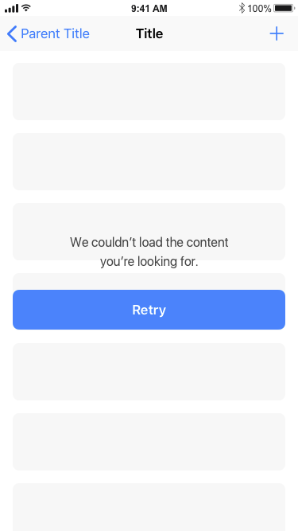
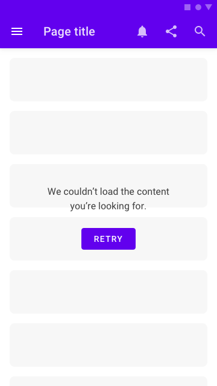
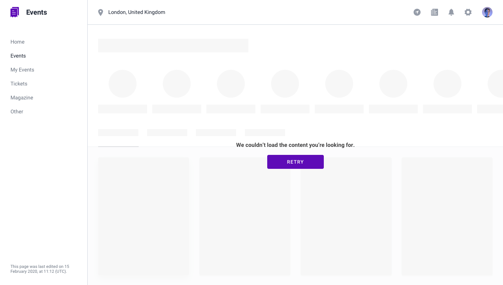

## Use Case
We can't load content from the server and we have no content to display while the error persist.

## Contents
* UI overlay (block UI)
* Error message
* UI Button (optional)
* Placeholder (optional)

## Best Practices
If we have a placeholder of the content that should be loaded, we can keep the placeholders to give users context of what they should be seeing. If we don't use/have placeholders, the background will be empty.

## Best used for
* 4XX errors (content/service not available)

## Screenshots/Demo

### iOS 

### Android
 |

### Web

