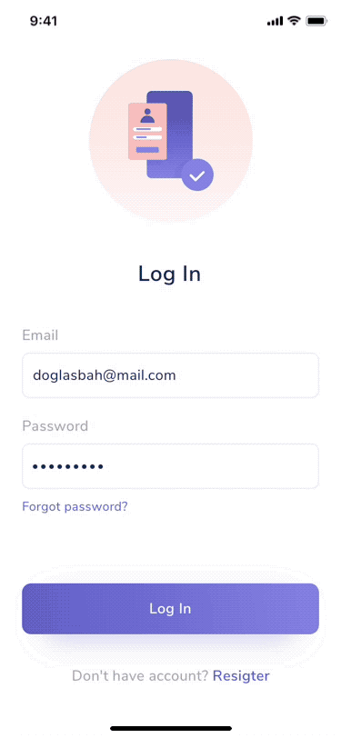
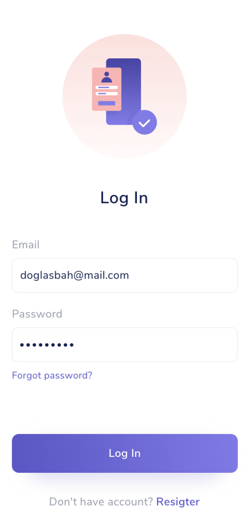

## Use Case
When transitioning from one screen to another one for which we need to load content.

## Contents
* UI Overlay
* Loading spinner/indicator

## Best Practices
* When loading, the UI must remain blocked.
* After a reasonable time, if no content can be loaded we should display then a [Full Screen Error](../fullscreen-error/fullscreen-error).

## Best used for
* Transitioning between two screens where loading content is required.
* When an actionable is pressed and takes time to process the information.

## Screenshots/Demo
### iOS

### Android

### Web

