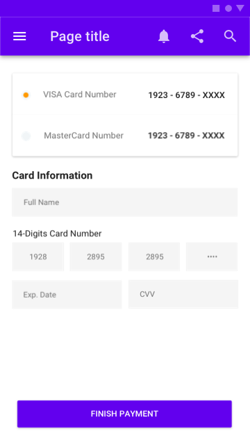

## Use Case
We can't trigger an action made by the user (clicking a button), because of an error.

## Contents
* UI Modal (iOS)
* UI Snackbar (Android)
* UI Toast (Web)
* Error description
* Timer (Automatic dismiss, optional, only in Android/Web)
* Action Button (Optional in Android/Web)

## Best Practices
_Only for Web & Android_
If the error isn't critical, we can add a timer and let the error move away from the screen automatically after some seconds (3.000-4.000 ms). If the error is critical the best practice is to let it stay and add a "Close" or "Dismiss" action button.

## Best used for
* Actionable errors

## Screenshots/Demo
### iOS

### Android

### Web

